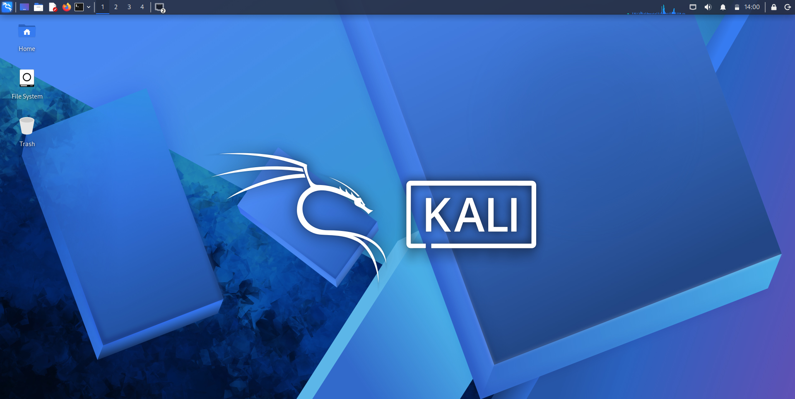
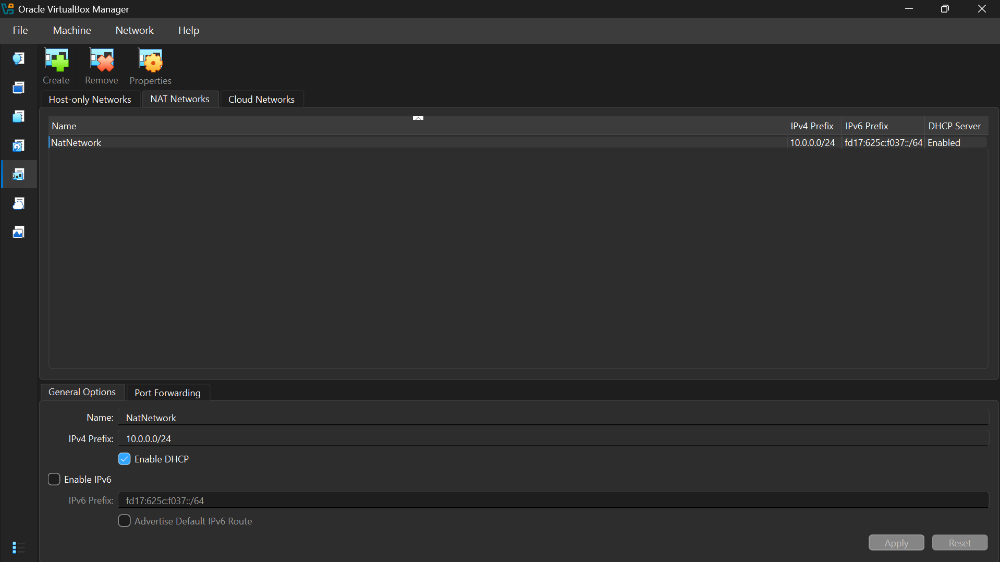
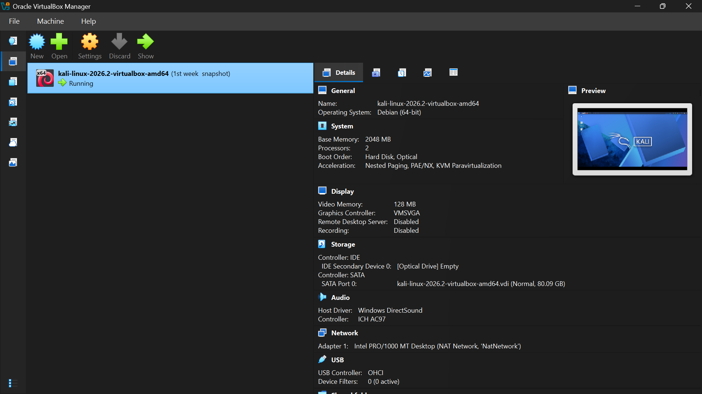
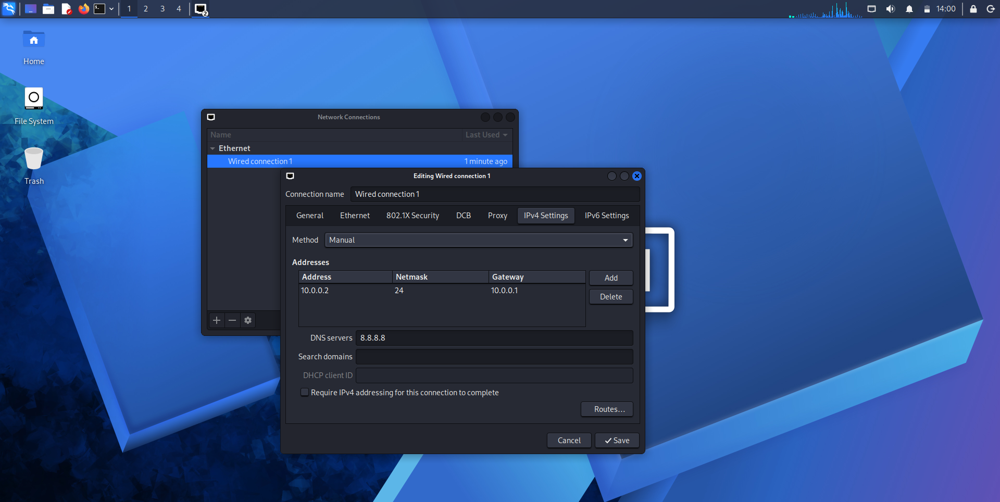

# Networkwalks B082 - Week 1: Cybersecurity Lab Setup

# 🔒 Practical Lab Environment Setup for Pentesting, Ethical Hacking & Cybersecurity

### Building an isolated virtual lab environment for hands-on cybersecurity testing

---

## 💻 Hardware & Host System Specs
- **Host Operating System:** Windows 11
- **Processor (CPU):** Intel Core i5
- **System RAM:** 8 GB
- **Storage:** 256 GB SSD
- **Hypervisor:** Oracle VirtualBox

---

## ⚙️ Attacker VM Allocations (Kali Linux)
- **Primary Attacker VM:** Kali Linux 2026.2
- **Allocated Memory (RAM):** 2048 MB (2 GB)
- **Allocated CPU Cores:** 2 Processor Cores
- **Network Mode:** Custom NAT Network (`NatNetwork`)
- **Subnet / IP Range:** `10.0.0.0/24`
- **Promiscuous Mode:** `Allow All`

---

## 🌐 Lab Network Architecture & IP Plan
All Virtual Machines in this lab setup are configured using a custom **NATNetwork** on subnet `10.0.0.0/24`.

| Virtual Machine | Operating System | IP Address / Configuration | Network Adapter Mode |
| :--- | :--- | :--- | :--- |
| **Attacker VM** | Kali Linux 2026.2 | `10.0.0.2 /24` (via DHCP) | NATNetwork (`NatNetwork`) |
| **Gateway Router** | VirtualBox Gateway | `10.0.0.1` | NATNetwork (`NatNetwork`) |

---

## 📋 Step-by-Step Implementation Workflow

### PHASE 1: Software Installation & Environment Setup
1. **Tooling & Hypervisor Installation:**
   - Downloaded and installed **7-Zip** for file extraction.
   - Installed **Oracle VirtualBox** on the Windows 11 host system.
2. **Global NAT Network Configuration:**
   - Navigated to VirtualBox `Tools -> Network -> NAT Networks`.
   - Created a custom NAT Network named **`NatNetwork`**.
   - Configured IPv4 Prefix to **`10.0.0.0/24`** with **DHCP Enabled**.
   - Disabled IPv6 to prevent routing and interface conflicts.
3. **VM Deployment:**
   - Imported **Kali Linux 2026.2** Virtual Machine into VirtualBox.
   - Assigned **2048 MB RAM** and **2 CPU Cores**.
   - Set Network Adapter 1 to **NAT Network** (`NatNetwork`) and enabled **Promiscuous Mode: Allow All** for packet capturing.

---

### PHASE 2: Network Troubleshooting & Issue Resolution

1. **IP & DNS Setup:**
   - Configured network interface `eth0` parameters with IPv4 gateway `10.0.0.1` and DNS server `8.8.8.8`.
2. **Fixing Kali Linux 2026.2 Disconnection Issue (DAD Timeout Fix):**
   - Encountered continuous internet drops/disconnections on Kali Linux 2026.2 over `eth0` caused by Duplicate Address Detection (DAD) delay.
   - Fixed the disconnection issue permanently using `nmcli`:
     ```bash
     sudo nmcli connection modify "Wired connection 1" ipv4.dad-timeout 0
     ```
   - Restarted `NetworkManager` service to establish a stable and uninterrupted connection:
     ```bash
     sudo systemctl restart NetworkManager
     ```

---

### PHASE 3: Verification & Snapshot Management
1. Verified stable network connectivity and performed ping tests to `google.com` to confirm DNS resolution and internet routing.
2. Created a clean **Snapshot** in VirtualBox for Kali Linux 2026.2 to preserve the stable state before conducting practical lab attacks.

---

## 📸 Lab Screenshots & Verification

### 1. Lab Desktop Environment


### 2. VirtualBox Global NAT Network Configuration


### 3. Kali Linux VM Allocation & Snapshot Details


### 4. Kali Linux Interface IP & DNS Configuration


### 5. Internet Connectivity & Ping Test Verification


---

## 📜 Credits & Acknowledgments
Special thanks to **Networkwalks Academy** and instructor **Waqas Karim (CCIE)** for providing the structured lab guide and training workflow.
