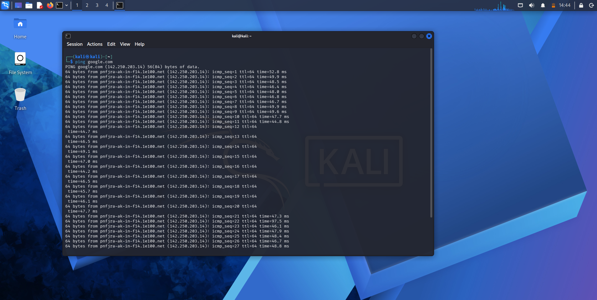

<h1 align="center"> 💻 Cybersecurity Lab Environment Setup</h1>

  
  
  
  
  
  
  
  
  
  
  

  <strong>networkwalks-B082-week1-Cybersecurity-lab-setup</strong>

  VirtualBox • Kali Linux • Virtual Networking • Linux Networking

<h1>🎯 Lab Purpose</h1>

The purpose of this lab is to build a <strong>controlled and isolated cybersecurity environment</strong> using Oracle VirtualBox and Kali Linux.

A dedicated virtual lab provides a safer environment for practicing cybersecurity concepts without directly experimenting on production systems or unauthorized networks.

The lab will be used as a foundation for practical learning in:

<ul>
  <li>Networking</li>
  <li>Linux</li>
  <li>Cisco</li>
  <li>Ethical Hacking</li>
  <li>VAPT</li>
  <li>Security Labs</li>
  <li>Python</li>
  <li>Security Automation</li>
</ul>

<h1>🖥️ Lab Environment</h1>

<table>
  <thead>
    <tr>
      <th>Component</th>
      <th>Details</th>
    </tr>
  </thead>
  <tbody>
    <tr>
      <td>Host Operating System</td>
      <td>Windows 11</td>
    </tr>
    <tr>
      <td>Processor</td>
      <td>Intel Core i5</td>
    </tr>
    <tr>
      <td>RAM</td>
      <td>8 GB</td>
    </tr>
    <tr>
      <td>Storage</td>
      <td>256 GB SSD</td>
    </tr>
    <tr>
      <td>Virtualization Platform</td>
      <td>Oracle VirtualBox</td>
    </tr>
    <tr>
      <td>Guest Operating System</td>
      <td>Kali Linux 2026.2</td>
    </tr>
    <tr>
      <td>VM Allocated RAM</td>
      <td>2048 MB (2 GB)</td>
    </tr>
    <tr>
      <td>VM Allocated Cores</td>
      <td>2 CPU Cores</td>
    </tr>
    <tr>
      <td>Network Type</td>
      <td>NAT Network (<code>NatNetwork</code>)</td>
    </tr>
    <tr>
      <td>Network CIDR</td>
      <td>10.0.0.0/24</td>
    </tr>
    <tr>
      <td>Kali Linux IP</td>
      <td>10.0.0.2/24 (via DHCP)</td>
    </tr>
    <tr>
      <td>Gateway</td>
      <td>10.0.0.1</td>
    </tr>
    <tr>
      <td>DNS</td>
      <td>8.8.8.8</td>
    </tr>
  </tbody>
</table>

<h1>🔗 Tools &amp; Resources</h1>

<ul>
  <li><strong>7-Zip:</strong> <a href="https://7-zip.org/download.html">https://7-zip.org/download.html</a></li>
  <li><strong>VirtualBox:</strong> <a href="https://virtualbox.org/wiki/Downloads">https://virtualbox.org/wiki/Downloads</a></li>
  <li><strong>Kali Linux:</strong> <a href="https://kali.org/get-kali">https://kali.org/get-kali</a></li>
</ul>

<h1>📝 Steps 1/6</h1>

<ul>
  <li>7-Zip</li>
  <li>Oracle VirtualBox</li>
  <li>NAT Network</li>
  <li>Kali Linux VM Setup</li>
  <li>Kali Linux Network Configuration &amp; Troubleshooting</li>
  <li>VirtualBox Snapshots</li>
</ul>

<h1>🛡️ Lab Setup</h1>

The Networkwalks Phase 1 workflow consists of six setup steps:

<ol>
  <li>Install 7-Zip</li>
  <li>Install Oracle VirtualBox</li>
  <li>Configure the VirtualBox NAT Network</li>
  <li>Download and import Kali Linux</li>
  <li>Configure Kali Linux IP settings &amp; resolve network disconnection</li>
  <li>Create a VM snapshot</li>
</ol>

<h1>🚀 Phase 01 — Lab Setup</h1>

<h2>1️⃣ 7-Zip Installation</h2>

<h3>What I Did</h3>

Installed <strong>7-Zip</strong> on Windows 11 to extract and manage virtual machine compressed archives.

<h3>Why</h3>

The Kali Linux virtual machine files require extraction before importing into the VirtualBox hypervisor.

<h3>Result</h3>

<strong>Status:</strong> ✅ Completed

<h2>2️⃣ Oracle VirtualBox Installation</h2>

<h3>What I Did</h3>

Installed and configured <strong>Oracle VirtualBox</strong> as the primary virtualization engine on Windows 11.

<h3>Why</h3>

VirtualBox provides the hypervisor environment to deploy, run, and isolate the Kali Linux machine safely.

<h3>Result</h3>

<strong>Status:</strong> ✅ Completed

<h2>3️⃣ NAT Network Configuration</h2>

<h3>What I Did</h3>

Created a custom <strong>NAT Network</strong> named <code>NatNetwork</code> within VirtualBox Global Network Preferences.

<h3>Why</h3>

To establish a dedicated, isolated subnet for the lab virtual machines with DHCP enabled and IPv6 disabled to avoid interface conflicts.

<pre><code>Network Type : NAT Network
Network Name : NatNetwork
Network CIDR : 10.0.0.0/24
DHCP         : Enabled
IPv6         : Disabled</code></pre>

<h3>Result</h3>

<strong>Status:</strong> ✅ Completed

  

<h2>4️⃣ Kali Linux VM Setup</h2>

<h3>What I Did</h3>

Imported <strong>Kali Linux 2026.2</strong> into VirtualBox, allocated hardware resources, and attached Adapter 1 to <code>NatNetwork</code>.

<h3>Why</h3>

Kali Linux acts as the primary attacker environment for penetration testing and network security practice.

<h3>VM Configuration</h3>
<pre><code>Operating System : Kali Linux 2026.2 (Debian 64-bit)
Allocated Memory : 2048 MB (2 GB)
Allocated CPU    : 2 Processors
Network Adapter  : NAT Network (NatNetwork)
Promiscuous Mode : Allow All</code></pre>

<h3>Result</h3>

<strong>Status:</strong> ✅ Completed

  

  

<h2>5️⃣ Kali Linux Network Configuration &amp; Troubleshooting</h2>

<h3>What I Did</h3>

Configured the <code>eth0</code> network interface parameters and resolved the persistent network disconnection issue on Kali Linux 2026.2.

<h3>Why</h3>

Ensures stable communication across the NAT Network subnet (<code>10.0.0.0/24</code>) and maintains permanent upstream internet connectivity without connection drops.

<h3>Network Settings</h3>
<pre><code>Interface  : eth0 (Wired connection 1)
IP Address : 10.0.0.2/24
Gateway    : 10.0.0.1
DNS        : 8.8.8.8</code></pre>

  

<h3>Troubleshooting: DAD Timeout Disconnection Fix</h3>

During runtime, <code>eth0</code> continuously lost internet connectivity due to Duplicate Address Detection (DAD) delay flags. Solved permanently using:

<pre><code class="language-bash"># Set DAD timeout to 0 on Wired connection 1
sudo nmcli connection modify "Wired connection 1" ipv4.dad-timeout 0

# Ping test verification to Google DNS
ping google.com</code></pre>

  

<h3>Result</h3>

<strong>Status:</strong> ✅ Completed

<h2>6️⃣ VirtualBox Snapshot</h2>

<h3>What I Did</h3>

Created a clean <strong>VirtualBox Snapshot</strong> named <code>1st week snapshot</code> after completing and verifying the network configuration.

<h3>Why</h3>

Provides an uncorrupted rollback baseline to restore the VM state before running security assessments or lab simulations.

<h3>Snapshot Purpose</h3>
<pre><code>Snapshot Name    : 1st week snapshot
Snapshot Purpose : Lab Backup &amp; Disaster Recovery</code></pre>

<h3>Result</h3>

<strong>Status:</strong> ✅ Completed

<h1>🏗️ Lab Architecture</h1>

<pre><code>Host Machine (Windows 11)
        │
        ▼
Oracle VirtualBox
        │
        ▼
NAT Network (10.0.0.0/24)
Gateway: 10.0.0.1  |  DNS: 8.8.8.8
        │
        ▼
Kali Linux 2026.2 VM
IP: 10.0.0.2/24  (eth0)
        │
        ▼
Cybersecurity Labs</code></pre>

<h1>🧠 Key Learning</h1>

During this setup, I gained practical hands-on experience with:

<ul>
  <li>Virtualization and hypervisor resource allocation</li>
  <li>VirtualBox custom NAT Network configuration</li>
  <li>Kali Linux 2026.2 deployment and optimization</li>
  <li>IPv4 subnetting and DNS configuration</li>
  <li>Troubleshooting Linux NetworkManager and resolving DAD timeout issues via <code>nmcli</code></li>
  <li>Connectivity testing using ICMP echo requests</li>
  <li>VirtualBox snapshot creation and state recovery</li>
</ul>

<h1>🔐 Security &amp; Ethics</h1>

This virtual laboratory is built strictly for <strong>educational and authorized cybersecurity learning purposes</strong>.

Security testing and assessments should only be conducted on systems, networks, or applications that you own or have explicit written permission to evaluate.

<h1>👨‍🏫 Mentor</h1>

<strong>Waqas Karim (CCIE)</strong>

Thank you for the guidance and practical learning blueprints throughout the lab setup.

<h1>📊 Phase 01 Progress</h1>

<strong>6 / 6 Steps Completed ✅</strong>

<blockquote>
  
🔐 <strong>Learn • Practice • Build • Secure</strong>

</blockquote>

<strong>Networkwalks Cybersecurity Internship — Week 01</strong>

